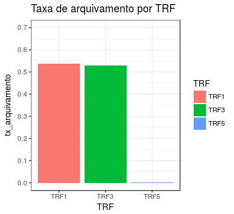
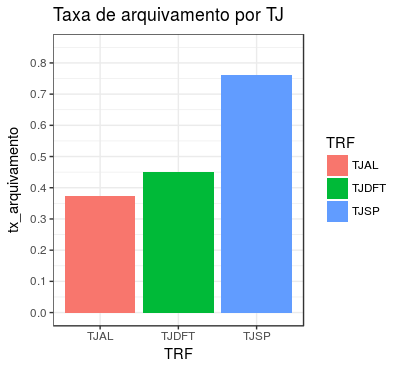

\pagebreak

# Levantamento das coletas sobre os tribunais


Os tribunais requisitados para esta apresentação foram os TRFs e TJs, entre eles,


1. TRF

    a) TRF-1
    
    b) TRF-2
    
    c) TRF-3
    
    d) TRF-5
      
2. TJ

    a) TJSP
    
    b) TJAL
    
    c) TJDFT
    
    d) TJRJ


Alguns deles não estão na análise, pois foram retirados para realizar uma coleta mais consistente, como por exemplo, o TRF-2 ou tiveram problemas na coleta como TJRJ. Além disso, cabe destacar que o caso do TRF-5 precisa ser discutido, pois a maioria das decisões não são capazes de informar o arquivamento ou não dos casos (irei explorar este caso ao longo do relatório).

# TRF (Tribunal Regional Federal)

## TRF-1


    1. Número de processos em segunda instância levantados.


__315__


    2. Taxa de arquivamento nos processos de segunda instância


Para obter a taxa de arquivamento nos processos, basta procurar, por meio de regex, palavras que podem estar relacionadas com tal ação. As palavras escolhidas e suas variações foram, -_rejeitar_, _declarar extinta_ e _arquivou_.


Sendo assim a taxa de arquivamento no TRF-1 foi de __53,7%__.


## TRF-2


Nova coleta em andamento.


## TRF-3


    1. Número de processos em segunda instância levantados.


__138__


    2. Taxa de arquivamento nos processos de segunda instância


Para obter a taxa de arquivamento nos processos, basta procurar, por meio de regex, palavras que podem estar relacionadas com tal ação. As palavras escolhidas e suas variações foram, -_rejeitar_, _declarar extinta_ e _arquivou_.


Sendo assim a taxa de arquivamento no TRF-3 foi de __52,9%__.


## TRF-5


    1. Número de processos em segunda instância levantados.


__857__


    2. Taxa de arquivamento nos processos de segunda instância


Para obter a taxa de arquivamento nos processos, basta procurar, por meio de regex, palavras que podem estar relacionadas com tal ação. As palavras escolhidas e suas variações foram, -_rejeitar_, _declarar extinta_ e _arquivou_.


Sendo assim a taxa de arquivamento no TRF-5 foi de __0,2%__. O resultado se dá devido a forma como o dado está disponível. A lista abaixo mostra como e quantas decisões aparecem na base:


* À unanimidade, em preliminar, firmar a competência do TRF/5ª Reg… - 1      

* DECIDE  O  PLENÁRIO  DO  TRF,  POR UNANIMIDADE, REJEITAR A DENÚ... - 1 

* MAIORIA, rejeitar a preliminar de incompetência da Justiça Feder… - 1

* POR MAIORIA - 135     

* POR MAIORIA, INDEFERIR A PRELIMINAR DE INCOMPETÊNCIA, E, À UNANI… -1 

* POR UNANIMIDADE, ACOLHER A PRELIMINAR DE INCOMPETÊNCIA ABSOLUTA…  -1

* POR UNANIMIDADE, DECLINAR DA COMPETÊNCIA EM FAVOR DA JUSTIÇA FED… -1       

* POR UNANIMIDADE, DECLINAR DA COMPETÊNCIA, E POR MAIORIA, DETERMI… -1       

* Por unanimidade,  receber a denúncia, e, por maioria, determinar… -1       

* POR UNANIMIDADE, RECEBER A DENÚNCIA, POR MAIORIA, DETERMINOU O E… -1       

* UNÂNIME - 713

## Visualização gráfica

```{r eval=T, echo=FALSE}

```


# TJ (Tribunal de Justiça)


## TJSP


    1. Número de processos em segunda instância levantados.


__1001__


    2. Taxa de arquivamento nos processos de segunda instância


Para obter a taxa de arquivamento nos processos, basta procurar, por meio de regex, palavras que podem estar relacionadas com tal ação. As palavras escolhidas e suas variações foram, -_rejeitar_, _declarar extinta_ e _arquivou_.


Sendo assim a taxa de arquivamento no TJSP foi de __76,2%__.


## TJAL


    1. Número de processos em segunda instância levantados.


__8__


    2. Taxa de arquivamento nos processos de segunda instância


Para obter a taxa de arquivamento nos processos, basta procurar, por meio de regex, palavras que podem estar relacionadas com tal ação. As palavras escolhidas e suas variações foram, -_rejeitar_, _declarar extinta_ e _arquivou_.


Sendo assim a taxa de arquivamento no TJAL foi de __37,5%__.


## TJDFT


    1. Número de processos em segunda instância levantados.


__80__


    2. Taxa de arquivamento nos processos de segunda instância


Para obter a taxa de arquivamento nos processos, basta procurar, por meio de regex, palavras que podem estar relacionadas com tal ação. As palavras escolhidas e suas variações foram, -_rejeitar_, _declarar extinta_ e _arquivou_.


Sendo assim a taxa de arquivamento no TJDFT foi de __45%__.


## Visualização gráfica

```{r eval=T, echo=FALSE}

```