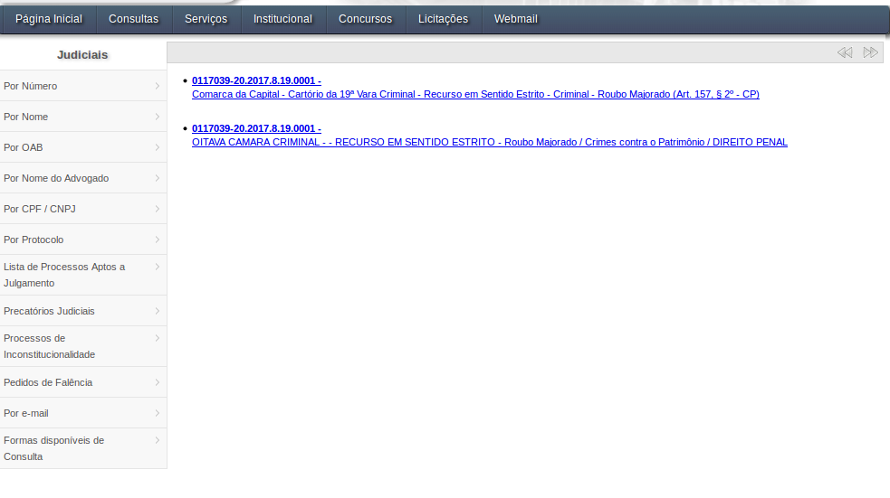

```{r}
library(rvest)
library(httr)
library(dplyr)
library(stringr)
```

Os links gerados tem pelo menos dois tipos de resultados

1. Tipo 1: Redireciona para página de interesse

```{r}
knitr::include_graphics("img/tipo1.png")
```

2. Tipo 2: apresenta a primeira ou segunda instancia

```{r}

```

```{r}
obter_json <- function(url , path = "data-raw/"){
  request <- httr::GET(url)
  
  if(stringr::str_detect(request$url, "ConsultaProcesso") == FALSE){
    nAntigo <- request %>%
      httr::content() %>%
      rvest::html_nodes(xpath = '//form//li/a') %>% 
      rvest::html_attr("href") %>%
      stringr::str_trim() %>% purrr::pluck(2) %>% 
      stringr::str_extract("(N=).*") %>% 
      stringr::str_extract("[0-9]+")
  } else {
    nAntigo <- request %>% 
      stringr::str_extract("(N=).*") %>% 
      stringr::str_extract("[0-9]+")
  }
  path <- normalizePath(path)
  nAntigo <- stringr::str_replace_all(nAntigo, "[[:punct:]]", "")
  file <- stringr::str_c(path,"/", nAntigo, ".html")

  url_tipo_POST <- "http://www4.tjrj.jus.br/ejud/WS/ConsultaEjud.asmx/DadosProcesso_1"

  query <- list(
    "nAntigo"= nAntigo,
    "pCPF"=""
  )

  httr::POST(url_tipo_POST,
           body = query,
           httr::write_disk(file, overwrite = T),
           encode = "json")
  return(nAntigo)
}
url <- "http://www4.tjrj.jus.br/numeracaoUnica/faces/index.jsp?numProcesso="  
tjrj <- readr::read_rds("/home/nathang/Documentos/Scripts and Documents/ESTAGIO_ABJ/ABJ/tjs/jurisprudencia/TJRJ/data-raw/data-raw_rds/exemplo.rds") %>% 
  dplyr::select(num_proc) %>% dplyr::mutate(url = str_c(url, num_proc))

nAntigos <- purrr::map_chr(tjrj$url, ~obter_json(.x))

files <- dir(path = "data-raw/", full.names = T)

json_arq <- files[1] %>% readLines(encoding = "latin1") %>%  jsonlite::fromJSON()

json_arq <- json_arq$d

list_to_df <- list()
names_to_df <- c()
for(i in 1:length(json_arq)){
  if(typeof(json_arq[[i]]) == "character"){
    list_to_df <- append(list_to_df,json_arq[[i]])
    names_to_df[i] <- append(names_to_df,names(json_arq[i]))
  }
}
names(lista) <- nomes

## Código para arrumar as datas atuação
# dados %>% 
#   dplyr::mutate(dt = as.numeric(stringr::str_extract(data_autuacao, "[0-9]+")) / 1000) %>% 
#   dplyr::mutate(dt = lubridate::as_datetime(dt))
```

