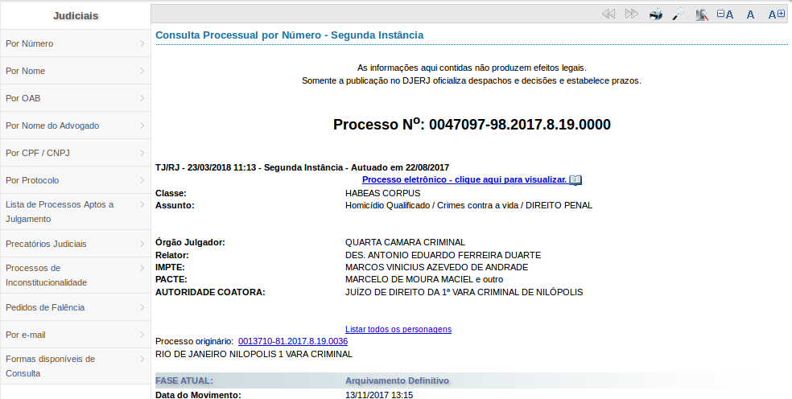

```{r}
library(rvest)
library(httr)
library(dplyr)
library(stringr)
```

```{r}
# Neste site tem como fazer a busca pela primeira e a segunda instancia
# parece que a busca de segunda instancia tem captcha
url <- "http://www4.tjrj.jus.br/numeracaoUnica/faces/index.jsp?numProcesso="

tjrj <- readr::read_rds("/home/nathang/Documentos/Scripts and Documents/ESTAGIO_ABJ/ABJ/tjs/jurisprudencia/TJRJ/data-raw/data-raw_rds/exemplo.rds") %>% 
  dplyr::select(num_proc) %>% dplyr::mutate(url = str_c(url, num_proc))

# tjrj <- tjrj %>% select(num_proc) %>%dplyr::mutate(num_proc = abjutils::clean_id(num_proc)) %>% tidyr::separate(num_proc, into= c("prim_parte", "seg_parte"), sep = "(819)")

head(tjrj$url)
```

Os links gerados tem pelo menos dois tipos de resultados

1. Tipo 1: Redireciona para página de interesse

```{r}

```

2. Tipo 2: apresenta a primeira ou segunda instancia

```{r}
knitr::include_graphics("img/tipo2.png")
```